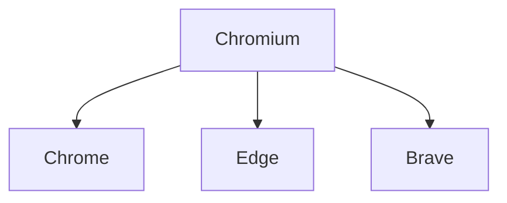

# #001 「Chromiumプロジェクトとは？Googleが作る理由」

```bash
# Chromium公式リポジトリ
git clone https://chromium.googlesource.com/chromium/src.git
```

```json
{
  "chromium": {
    "license": "BSD-style",
    "governance": "Chromium Project",
    "stakeholders": ["Google", "コミュニティ", "ブラウザベンダー"]
  }
}
```


