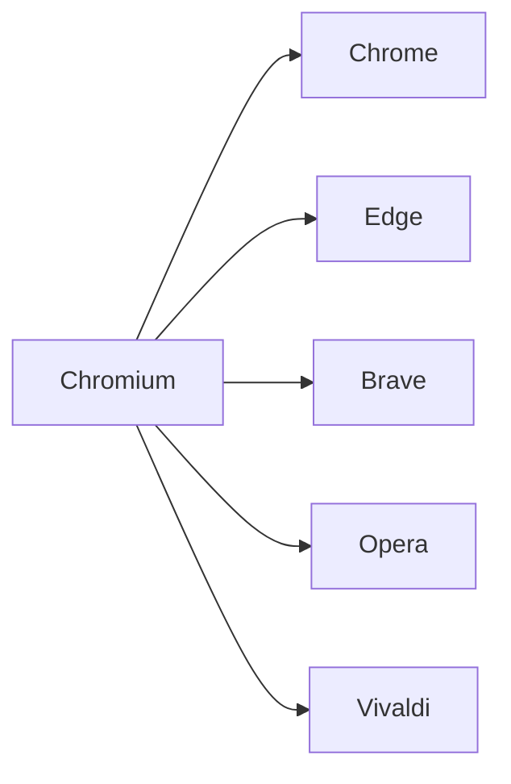

# #005 「Chromiumを使っている有名ブラウザたち」

```markdown
| ブラウザ        | ベース       | 主な差別化要素                     |
|-----------------|--------------|------------------------------------|
| Google Chrome   | Chromium + Googleサービス | Sync, Safe Browsing, Widevine  |
| Microsoft Edge  | Chromium     | Collections, Sleeping Tabs         |
| Brave           | Chromium     | Ad-block, BAT報酬                  |
| Opera           | Chromium     | Sidebar, 内蔵VPN                   |
| Vivaldi         | Chromium     | 高度なUIカスタム                   |
```



```bash
# ユーザーエージェントでBlink派生を確認
navigator.userAgent.includes("Chrome") // trueならChromium系の可能性
```
