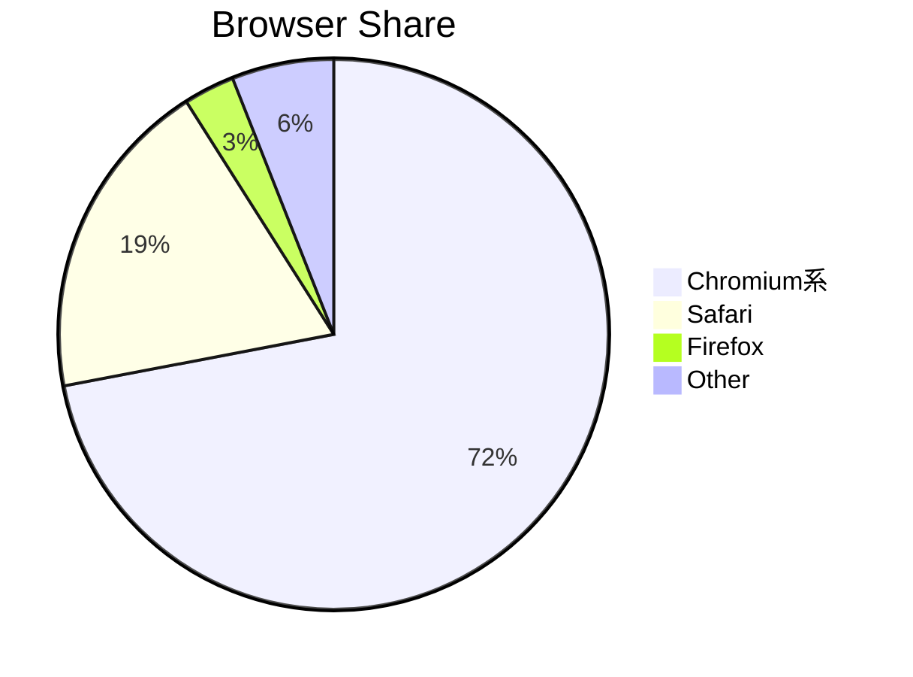

# #008 「ブラウザ市場シェアとChromiumの影響力」

```markdown
### 2024年世界ブラウザシェア（StatCounter推定）
- Chromium系: ~72%
- Safari(WebKit): ~19%
- Firefox(Gecko): ~3%
- その他: ~6%
```



```text
注意点
- 多数派でもベンダープレフィックスは避ける
- Interop 2024など協調イニシアチブに参加
```
